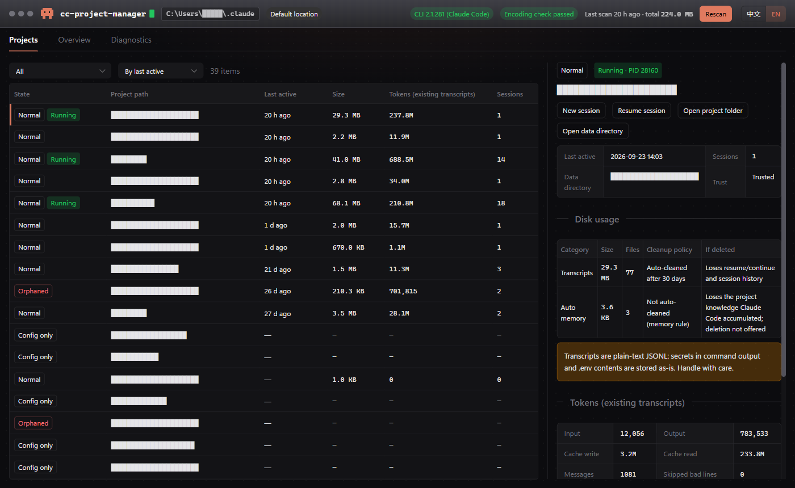
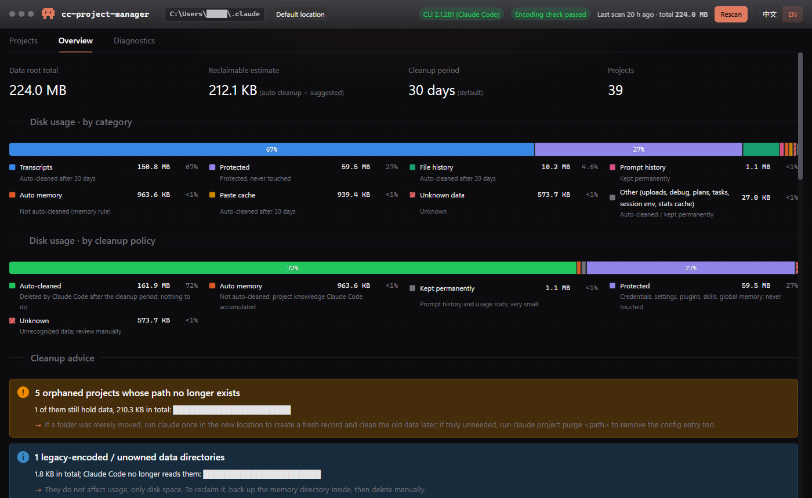

<p align="center">
  
</p>

<h1 align="center">CC Project Manager</h1>

<p align="center">
  <a href="README.md">中文</a> · <b>English</b>
</p>

<p align="center">
  
  
  
</p>

A Windows desktop tool that makes sense of what [Claude Code](https://claude.com/claude-code) leaves under `%USERPROFILE%\.claude`: which projects are active, how much disk each one takes, how many tokens they used, which ones are orphaned or leftover data, and what the next automatic cleanup will delete.

**Strictly read-only against `.claude`**: it never modifies, moves or deletes anything in that directory.

## Screenshots

| Projects | Overview |
| --- | --- |
|  |  |

The UI is available in English and Chinese; switch with the toggle in the top-right corner. Paths in the screenshots are redacted.

## Features

- **Project list**: every project Claude Code has recorded, sorted by last activity, filterable by state.
- **Project states**: Normal / Config only / Orphaned / Unreachable / Unowned data / Legacy encoding, so you can spot projects that no longer exist.
- **Running detection**: marks projects with a live Claude Code session, ruling out stale session files and reused PIDs.
- **Disk usage**: `.claude` usage broken down by category, each labelled with its cleanup policy and what you lose if it is deleted, plus a reclaimable-space estimate.
- **Token usage**: input / output / cache tokens for each project's existing transcripts, and Claude Code's own global statistics.
- **Cleanup simulation and advice**: how much the next automatic cleanup will remove, and what to do about orphaned projects and legacy directories.
- **Quick actions**: start or resume a Claude Code session in the project folder; open the project folder, its data directory, or the insights report.
- **Diagnostics**: data root, CLI version, directory-encoding self-check and session-file verdicts for troubleshooting.

## Download and run

1. Grab the latest build from [Releases](../../releases):
   - `cc-project-manager.exe`: portable, no installation, just run it.
   - `CC Project Manager_x.y.z_x64-setup.exe`: installer.
2. The first launch scans `.claude` once (usually a few seconds). Later launches show cached results immediately; click **Rescan** in the top-right corner to refresh.

**Requirements**

- Windows 10 / 11 (x64) with the [WebView2 runtime](https://developer.microsoft.com/microsoft-edge/webview2/) (bundled with Windows 11).
- Claude Code installed on this machine. The app opens without it, but there is nothing to show; the **New session / Resume session** buttons need `claude` on your PATH.
- If you relocated the data directory with `CLAUDE_CONFIG_DIR`, the tool follows it automatically.

A step-by-step guide (Chinese) is in the [user manual](docs/CC%20Project%20Manager（Windows）使用手册.md).

## Data safety

- Read-only against `.claude`. The tool's own cache lives in `%LOCALAPPDATA%\CCProjectManager\cache\` and can be deleted at any time.
- No network access, nothing is uploaded.
- **New session / Resume session** simply open a PowerShell window and run `claude`; everything after that is identical to running it yourself.

## Build from source

Prerequisites: Rust stable (MSVC toolchain), Node.js 20 or newer, Visual Studio 2022 with the "Desktop development with C++" workload.

```powershell
npm install
npm run tauri dev      # development mode
npm run tauri build    # bundles: target\release\cc-project-manager.exe and target\release\bundle\nsis\
```

Tests:

```powershell
cargo test             # Rust core library
npm test               # frontend
```

## Project layout

| Directory | Contents |
| --- | --- |
| `crates/cc_core/` | Rust core: path resolution, directory encoding, project discovery, session verdicts, scanning and statistics |
| `src-tauri/` | Tauri 2 shell: commands, cache, crisp window icon |
| `src/` | Vue 3 + TypeScript + Naive UI frontend, with zh/en strings |
| `design/icons/` | Icon sources and the multi-size ICO build script |
| `docs/` | Requirements, design and user manual (Chinese) |

## Tech stack

Tauri 2 · Rust · Vue 3 · TypeScript · Vite · Naive UI · Pinia

## Roadmap

The current release is read-only. Planned: project purge (dry-run first), memory migration and rebinding, memory export / import, per-category transcript cleanup.

## License

[MIT](LICENSE) © 2026 ericpa
