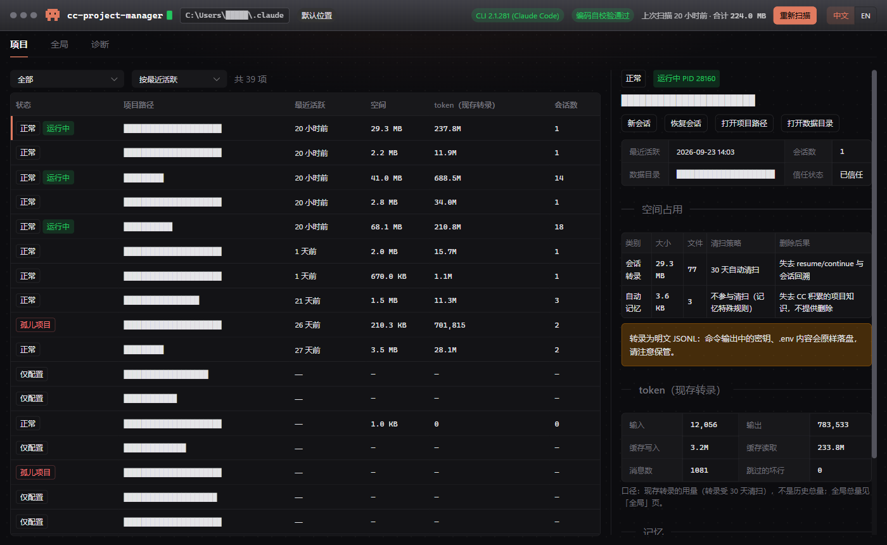
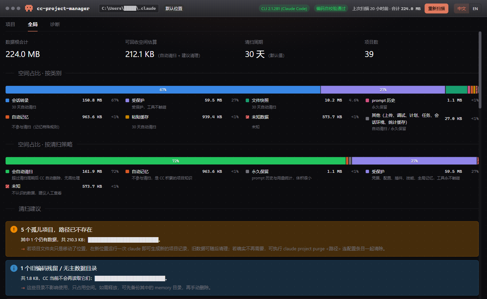

<p align="center">
  
</p>

<h1 align="center">CC Project Manager</h1>

<p align="center">
  <b>中文</b> · <a href="README.en.md">English</a>
</p>

<p align="center">
  
  
  
</p>

一个 Windows 桌面工具，把 [Claude Code](https://claude.com/claude-code) 在本机 `%USERPROFILE%\.claude` 目录下留下的项目状态看清楚：哪些项目最近在用、各占多少空间、用了多少 token、哪些是孤儿或残留数据、下次自动清扫会删掉什么。

**对 `.claude` 目录完全只读**：不会修改、移动或删除其中任何文件。

## 界面预览

| 项目页 | 全局页 |
| --- | --- |
|  |  |

界面支持中文 / English，右上角一键切换。截图中的路径已打码。

## 功能

- **项目清单**：列出 Claude Code 记录过的全部项目，按最近活跃排序，可按状态筛选。
- **项目状态**：正常 / 仅配置 / 孤儿 / 路径不可达 / 无主数据 / 旧编码残留，一眼看出哪些项目已经不存在。
- **运行中识别**：标出正在运行 Claude Code 的项目，能排除僵尸会话文件和 PID 被复用的情况。
- **空间占用**：按类别统计 `.claude` 的磁盘占用，标注每类数据的清扫策略与删除后果，并给出可回收空间估算。
- **token 用量**：每个项目现存转录的输入 / 输出 / 缓存 token，以及 Claude Code 自己的全局统计。
- **清扫模拟与建议**：模拟下次自动清扫会删掉多少，对孤儿项目、旧编码残留目录给出处理建议。
- **快捷操作**：在项目目录打开 Claude Code 新会话或恢复会话，打开项目目录、数据目录、insights 报告。
- **诊断页**：数据根、CLI 版本、目录编码自校验、会话文件判定，排查问题时用。

## 下载与运行

1. 到 [Releases](../../releases) 下载最新版本：
   - `cc-project-manager.exe`：便携版，无需安装，双击即用。
   - `CC Project Manager_x.y.z_x64-setup.exe`：安装包。
2. 首次启动会扫描一次 `.claude` 目录（通常几秒钟），之后启动直接显示缓存结果，点右上角「重新扫描」刷新。

**运行要求**

- Windows 10 / 11（x64），已安装 [WebView2 运行时](https://developer.microsoft.com/microsoft-edge/webview2/)（Windows 11 自带）。
- 本机安装过 Claude Code。没装也能打开，但没有数据可看；「新会话 / 恢复会话」按钮需要 `claude` 命令在 PATH 中。
- 若通过 `CLAUDE_CONFIG_DIR` 环境变量改过数据目录位置，工具会自动跟随。

更详细的操作说明见 [使用手册](docs/CC%20Project%20Manager（Windows）使用手册.md)。

## 数据安全

- 对 `.claude` 目录只读。工具自己的缓存只写在 `%LOCALAPPDATA%\CCProjectManager\cache\`，可随时删除。
- 不联网、不上传任何数据。
- 「新会话 / 恢复会话」只是替你打开一个 PowerShell 并运行 `claude`，之后的行为与手动运行完全一样。

## 从源码构建

需要：Rust stable（MSVC 工具链）、Node.js 20 或更新、Visual Studio 2022「使用 C++ 的桌面开发」工作负载。

```powershell
npm install
npm run tauri dev      # 开发模式
npm run tauri build    # 打包：target\release\cc-project-manager.exe 与 target\release\bundle\nsis\
```

运行测试：

```powershell
cargo test             # Rust 核心库
npm test               # 前端
```

## 项目结构

| 目录 | 内容 |
| --- | --- |
| `crates/cc_core/` | Rust 核心库：路径解析、目录编码、项目发现、会话判定、扫描与统计 |
| `src-tauri/` | Tauri 2 壳层：命令、缓存、窗口图标 |
| `src/` | Vue 3 + TypeScript + Naive UI 前端，含中英文案 |
| `design/icons/` | 图标源文件与多尺寸 ICO 生成脚本 |
| `docs/` | 需求规格、软件设计、使用手册（中文） |

## 技术栈

Tauri 2 · Rust · Vue 3 · TypeScript · Vite · Naive UI · Pinia

## 路线图

当前版本只读。计划中的能力：删除项目（purge，先 dry-run 再执行）、记忆迁移与重绑定、记忆导出 / 导入、按类别清理转录。

## 许可证

[MIT](LICENSE) © 2026 ericpa
